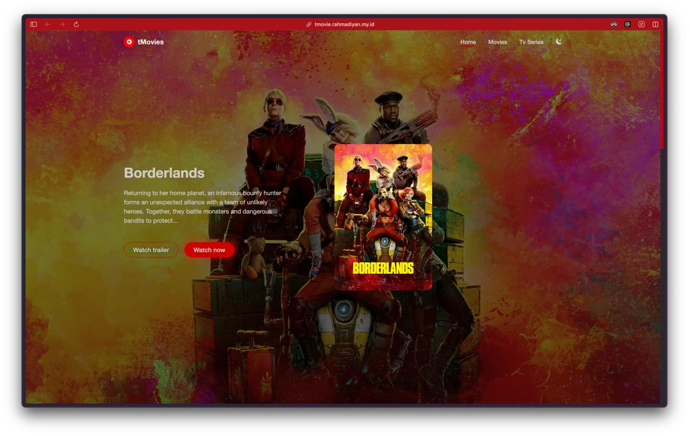

# TMovie

## Overview

TMovie is a Next.js-based application that allows users to browse and search for movies, view movie details, and manage their favorite movies and ultimately watch it. The app integrates with The Movie Database (TMDb) API to fetch movie data and provides a responsive, user-friendly interface and vidsrc embed API to directly embed movie for easy streaming.

Demo: [https://tmovie.rahmadiyan.my.id](https://tmovie.rahmadiyan.my.id)

## Features

1. Movie browsing: Users can view popular movies on the home page.
2. Search functionality: Users can search for movies by title.
3. Movie details: Detailed information about each movie, including title, release date, overview, and poster.
4. Favorite movies: Users can add movies to their favorites list and view them separately.
5. Responsive design: The app is optimized for various screen sizes.
6. Stream movies directly from anywhere

## Technology Stack

- Next.js 13 (React framework)
- TypeScript
- Tailwind CSS (for styling)
- Zustand (for state management)
- The Movie Database (TMDb) API
- Vidsrc Embed API

## Key Components

### Layout

The app uses a consistent layout across all pages, defined in:

This layout includes the `Navbar` component and wraps the main content in a container.

### Navbar

The `Navbar` component provides navigation links and the search functionality:

### Movie Card

The `MovieCard` component displays individual movie information in a grid:

### Movie Details

The movie details page is implemented in:

This page fetches and displays detailed information about a specific movie.

### Favorites

The favorites functionality is managed using Zustand:

Users can view their favorite movies on the favorites page:

## API Integration

The app integrates with The Movie Database (TMDb) API to fetch movie data. API calls are made using the `fetch` function with appropriate headers and error handling. It also integrate embedding movie streaming using Vidsrc

## Styling

The app uses Tailwind CSS for styling, providing a responsive and modern design. Custom styles are defined in the `globals.css` file.

## Getting Started

1. Clone the repository
2. Install dependencies: `npm install`
3. Set up environment variables:
   - Create a `.env.local` file in the root directory
   - Add your TMDb API key: `NEXT_PUBLIC_API_KEY=your_api_key_here`
4. Run the development server: `npm run dev`
5. Open [http://localhost:3000](http://localhost:3000) in your browser

## Deployment

The app can be easily deployed to platforms like Vercel or Netlify that support Next.js applications. Ensure that you set the environment variables in your deployment platform's settings.

## Future Improvements

- User authentication
- Personalized movie recommendations
- Movie ratings and reviews
- Trailer playback functionality
- Pagination for movie listings

This README provides a comprehensive overview of the movie webapp, its features, and technical implementation. It serves as a guide for developers who want to understand, maintain, or extend the application.